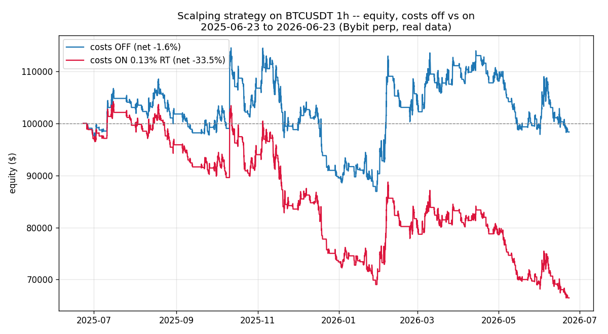

# Scalping cost-wall demonstration — the video's strategy on real BTC, costs off vs on

**Date:** 2026-06-23 · **Issue:** #311 (makes #309's cost gate empirical)
**Script:** `backtest/run_scalping_cost_wall.py` (research-only; no Alpaca import, no orders, public read-only market data only)
**Chart:** `docs/research/2026-06-23-scalping-cost-wall-equity-curve.png`

---

## Question, and what is load-bearing

The operator watched a YouTube crypto-scalper run an "ATR trend multi-confirmation" strategy over
**hundreds of trades** and asked whether that volume of trading is itself a path to profit. Issue
**#309** answered with cheap arithmetic (the
[short-horizon feasibility gate](2026-06-23-short-horizon-feasibility-gate.md)): a high-churn rule's
annualized cost drag is `trades_per_day × 252 × c`, and at crypto taker fees that drag is large
enough to make the high-churn end mathematically unwinnable before any edge is even discussed.

This study makes that arithmetic **empirical**. We run a faithful reconstruction of the video's
strategy through a fair backtest on **real BTC intraday data**, twice — costs off and costs on — and
a cost sweep that finds the **break-even cost**. The load-bearing finding is the **costs-off-vs-on
delta** and the break-even cost, **not** the absolute P/L: the exact Pine parameters from the video
are unknown, so the absolute number is one reconstruction among many, but the *shape* of how cost
erodes it is robust.

> **The delta is the finding.** A strategy can look fine with costs off and be a disaster with costs
> on. The gap between the two is the cost wall. We measure exactly where it falls.

---

## Data source

Real BTC intraday OHLCV, no fabrication. (Per the script, if no source had worked it would have
raised `BLOCKED` rather than invent prices.)

| Field | Value |
|---|---|
| Venue | Bybit (perpetual futures) |
| Endpoint | `GET https://api.bybit.com/v5/market/kline?category=linear&symbol=BTCUSDT` (public, read-only, no auth) |
| Symbol | `BTCUSDT` linear perp |
| Window (pinned, UTC) | `2025-06-23 00:00:00` → `2026-06-23 00:00:00` (one full year) |
| Resolutions | 1h (`interval=60`), 15m (`interval=15`), 5m (`interval=5`) |
| Row counts (after dropping the in-progress bar) | 1h: **8 760** bars · 15m: **35 040** · 5m: **105 120** |

The row counts equal `365 × {24, 96, 288}` exactly — crypto trades 24/7 with no holidays, so a clean
full-year window has no gaps, which also confirms the pagination did not silently truncate. Bybit
returns klines newest-first; the script reverses to chronological, dedupes on open-time, and keeps
only bars whose open-time falls inside the window.

The video traded crypto on a perp venue, so Bybit perp is the closest fair match. Coinbase spot and
yfinance `BTC-USD` were the documented fallbacks (not needed). Note the venue difference from #309,
which priced **Alpaca** crypto fees — see the reconciliation below.

---

## Strategy reconstruction

A **faithful approximation** with standard defaults. The exact Pine parameters from the video are
unknown; this is not pixel-identical, and that is exactly why the absolute P/L is not the headline.

**Long/short** (the version actually run — a perp lets you short, and it produces more trades, which
is the right test for a "hundreds of trades" question). Entry on bar `t`'s close requires **all** of:

| Condition | Default |
|---|---|
| Supertrend direction (hand-rolled ATR bands) | up for long / down for short — ATR length **10**, multiplier **3.0** |
| Trend strength | **ADX(14) > 25** |
| Volume confirmation | `volume > SMA(volume, 20)` |
| Momentum | MACD-hist(12/26/9) **> 0** for long, **< 0** for short |

**Exits.** Two stop mechanisms, and the doc states precisely how they interact:
- **Initial ATR stop:** `entry − 2·ATR` (long) / `entry + 2·ATR` (short), fixed at entry.
- **ATR trailing-stop take-profit:** starts at the same `2·ATR` distance and **ratchets** toward
  price as the trade moves favourably (long: `trail = max(trail, high − 2·ATR)`).
- The **binding** stop on any bar is `max(initial, trail)` for a long / `min(initial, trail)` for a
  short. The trailing stop becomes binding (and the exit is labelled `trail`) once it has ratcheted
  past the initial stop; until then the fixed initial stop governs. Exit is at the stop level.

Indicators use `ta` (ADX, MACD, ATR) for reviewer-checkable standard implementations; supertrend is
hand-rolled per the issue. ATR length 10 / mult 3.0 is used for both the supertrend bands and the
`2·ATR` stops.

### No look-ahead (hard rule)

- Signal computed on bar `t`'s close; the entry fills at bar **`t+1`'s open**.
- Stop/TP are checked only against **subsequent** bars' high/low.
- The trailing stop ratchets using the extreme of bars **strictly before** the bar being tested —
  the current bar's high/low can only *trigger* an exit, never widen the stop before that bar's low
  is tested (no intra-bar look-ahead).
- A bar that touches the binding stop exits **at the stop level** (conservative — no gap-through
  gift). Within a bar the stop is tested **before** the trailing stop is allowed to ratchet on that
  same bar (stop-first ordering), so a favourable wick cannot widen the stop before the bar's adverse
  extreme is checked. (The initial and trailing stops share one level at entry and the trail only
  ever ratchets toward price, so a single binding stop governs — there is no separate take-profit
  price level for a bar to touch independently; the trailing stop *is* the profit-taking mechanism.)
- The in-progress final bar is dropped.
- Self-check assertion in the loop: every exit timestamp is strictly after its entry.

---

## Cost model

Cost is charged on **every fill** (entry and exit), as a fraction of notional, folded into a single
round-trip number that is the only varied input in the cost sweep.

| Component | Value | Source / assumption |
|---|---|---|
| Bybit perp **taker** fee | 0.055% / side → **0.11%** round-trip | Bybit fee schedule, `https://www.bybit.com/en/help-center/article/Trading-Fee-Structure`, fetched 2026-06-23. Market scalp entries/exits are taker. |
| Crossed spread | ~1 bp / side → **0.02%** round-trip | Stated assumption for BTC perp top-of-book. |
| Funding | ≈ 0 / trade | Short scalps rarely span an 8h funding stamp; funding only ever **adds** cost, so omitting it understates the wall (errs honest). |
| **Realistic round-trip** | **0.13%** | Sum of the above. |
| Alpaca crypto **taker** (309 marker) | 0.25% / side → **0.50%** round-trip | Alpaca Tier-1 taker fee per #309. Different venue, ~3.8× the Bybit perp cost — see reconciliation. |

Cost sweep (round-trip): 0, 0.05%, 0.10%, 0.20%, 0.30%, 0.50%, 0.80%.

---

## Results

All numbers from a live Bybit pull on 2026-06-23 via `python3 backtest/run_scalping_cost_wall.py`.

### 1h cost sweep (same strategy + data; cost is the only varied input)

| Cost (round-trip) | Net return | Max DD | Profit factor | # trades | Win rate |
|---|---|---|---|---|---|
| **0.000% (costs off)** | **−1.64%** | −24.1% | **1.02** | 301 | 37.2% |
| 0.050% | −15.39% | −27.8% | 0.93 | 301 | 35.2% |
| 0.100% | −27.22% | −31.3% | 0.85 | 301 | 33.6% |
| **0.130% (realistic Bybit)** | **−33.51%** | −36.2% | 0.80 | 301 | 33.6% |
| 0.200% | −46.17% | −47.7% | 0.71 | 301 | 32.2% |
| 0.300% | −60.19% | −60.6% | 0.61 | 301 | 28.9% |
| **0.500% (Alpaca crypto taker)** | **−78.25%** | −78.3% | 0.44 | 301 | 25.2% |
| 0.800% | −91.24% | −91.2% | 0.29 | 301 | 20.6% |

> *Max DD is marked to each bar's close including open positions (intra-trade), so it is not
> closed-trade-only. Win rate falls as cost rises because the cost flips small gross winners into net
> losers; the trade count is identical across the sweep because cost does not change the entry/exit
> signals, only the P/L booked on each.*
>
> *On the costs-off row, profit factor 1.02 (> 1) sits next to net return −1.64% (< 0): not a
> contradiction. PF is the ratio of summed per-trade gain fractions to summed loss fractions
> (arithmetic), while net return is **compounded** on 100% notional, so volatility drag pulls the
> compounded result below an arithmetic-sum PF near 1.0. All three signals — PF ≈ 1, win rate 37%,
> net ≈ 0 — agree: no edge.*

**Break-even round-trip cost: 0.000%.** The strategy is **already a net loss at zero cost** — there
is no positive gross edge to fund any transaction cost. Both the realistic Bybit cost (0.13%) and the
Alpaca cost (0.50%) sit above break-even, so cost cannot be "the only problem"; it is the amplifier of
a strategy that has **no detectable edge to begin with**.

### Frequency sweep at the realistic 0.13% cost (resolution is the only varied input)

| Timeframe | Bars | Net return | Max DD | Profit factor | # trades | Win rate |
|---|---|---|---|---|---|---|
| 1h | 8 760 | −33.51% | −36.2% | 0.80 | **301** | 33.6% |
| 15m | 35 040 | −73.83% | −73.9% | 0.68 | **1 094** | 31.4% |
| 5m | 105 120 | −97.90% | −98.0% | 0.52 | **3 298** | 26.8% |

All three resolutions were actually run on the same one-year window. This is **#309's
`trades_per_day × c` arithmetic made empirical**: holding the cost fixed, finer resolution multiplies
the trade count (301 → 1 094 → 3 298) and the net loss deepens roughly in step (−34% → −74% → −98%).
"Hundreds of trades" is not a profit engine here — it is a **cost-multiplication engine**.

The blue (costs-off) curve oscillates around the $100k start and ends slightly below it — no edge.
The red (costs-on, 0.13%) curve bleeds steadily to ~$66k. The gap between them is pure cost.

---

## Reconciliation with #309 (no contradiction)

#309 killed crypto scalping using **Alpaca** taker fees (0.25%/side, 0.50% round-trip). This study
priced **Bybit perp** (0.055%/side, ~0.13% round-trip) — a different, ~3.8×-cheaper venue. A reader
might expect the cheaper venue to rescue the strategy. It does not, because the reconstruction has
**no positive gross edge**: with break-even at 0% cost, even Bybit's low fee lands on the wrong side
of the wall. #309 said you would need roughly a **53–65% win rate just to cover cost** at a tight
scalp; the observed win rate here is **37%** (costs off), far below that floor. That is directional
empirical confirmation of #309, not the exact `c/(2R)` identity (the trailing TP makes win sizes
variable, so this is confirmation of direction and magnitude, not an arithmetic match).

---

## Honest caveats (they strengthen the no-edge finding)

- **Fills are modeled slightly favorably.** Exits fill exactly at the stop level (no gap-through
  penalty), and the entry bar itself is not stop-tested. Both bias gross **upward**, so the true
  costs-off result is no better than −1.64% — the no-edge conclusion is conservative.
- **Reconstruction risk.** Exact Pine params are unknown; a different ATR/mult/stop choice would move
  the absolute number. The params were **fixed before any P/L was seen and never re-tuned** (the hard
  honesty rule), and the costs-off-vs-on delta — the load-bearing finding — does not depend on the
  exact params.
- **One asset, one year, one window.** BTC over 2025-06 → 2026-06. The cost wall (delta) is a
  property of the cost arithmetic and generalizes; the specific gross P/L does not.

---

## Conclusion

Tied directly to the operator's "hundreds of trades" question:

1. **The strategy has no detectable edge before costs.** Over 301 trades at 1h, gross profit factor
   is **1.02** and win rate **37%** — a coin flip. Costs-off net return is **−1.64%**, noise-level.
2. **Costs turn no-edge into a large loss.** At the realistic Bybit cost (0.13% round-trip) the 1h
   net return is **−33.5%**; at Alpaca's crypto fee (0.50%) it is **−78.3%**. Break-even cost is
   **0%** — there is no edge to fund any cost at all.
3. **More trades make it worse, not better.** At the fixed realistic cost, going 1h → 15m → 5m
   multiplies trades 301 → 1 094 → 3 298 and deepens the loss −34% → −74% → −98%. "Hundreds of trades"
   is the problem, not the solution — exactly #309's `trades_per_day × c` drag, now shown on real data.

The video's volume of trading is a cost-multiplication engine, not a profit engine. This is consistent
with #309's no-go on the high-churn / scalping end and with the repo's existing one-rule regime
strategy, which trades a handful of times a year precisely to keep cost drag negligible.
